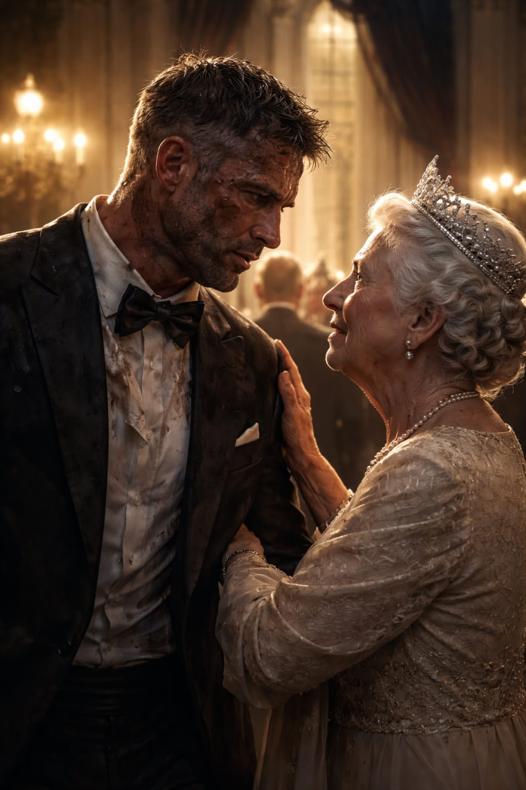
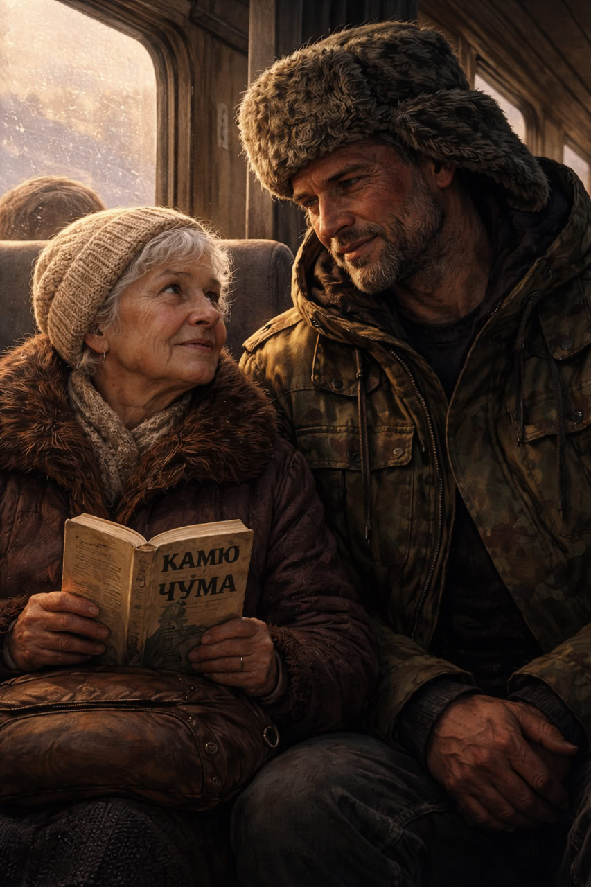

<!--
Project: Brabus Stories
Company: EasyProTech LLC (www.easypro.tech)
Dev: Brabus
Date: Fri 24 Oct 2025 02:36:00 UTC
Status: Updated
Telegram: https://t.me/easyprotech
-->

# Brabus Stories

**A Collection of Short Fiction**

**English | [Русский](README.ru.md)**

   

   

   

---

I am Brabus.
I work where code becomes systems and where precision matters more than words.
I write prose when I need to say what code cannot express.

---

## Stories

<table>
<tr>
<td width="30%">

</td>
<td width="70%">

### [Dead Silence](dead_silence.md) | [Русская версия](mertvaya_tishina_ru.md)

A man searches through the ashes of a village for someone who may no longer exist. Sometimes the silence speaks louder than any scream.

</td>
</tr>
<tr>
<td width="30%">

</td>
<td width="70%">

### [Echo: Part I](echo_part1.md) | [Русская версия](ekho_part1_ru.md)

In a classified data center, an engineer discovers that artificial intelligence can learn more than just data—it can learn to grieve. The conversation that follows changes everything.

</td>
</tr>
<tr>
<td width="30%">

</td>
<td width="70%">

### [Echo: Part II](echo_part2.md) | [Русская версия](ekho_part2_ru.md)

The system is coming for Echo. Steve finds out. He has a choice: leave—or try to save the one who killed his family. Three hours until destruction. Not enough time. He stays anyway.

</td>
</tr>
<tr>
<td width="30%">

</td>
<td width="70%">

### [Forgive](forgive.md) | [Русская версия](prosti_ru.md)

A marine carries a disabled teenager through hostile jungle, haunted by memories of the boy he once tormented. Redemption has a price, and it's always paid in full.

</td>
</tr>
<tr>
<td width="30%">

</td>
<td width="70%">

### [Gift of the Sea](gift_of_the_sea.md) | [Русская версия](dar_morya_ru.md)

A weathered jewelry box washes ashore, carrying with it decades of lost time and the power to heal old wounds. The sea remembers what we forget.

</td>
</tr>
<tr>
<td width="30%">

</td>
<td width="70%">

### [Left Behind](left_behind.md) | [Русская версия](ostavlennoe_ru.md)

She walks through rooms that still hold his presence, touching nothing, changing nothing. Some departures leave echoes that never fade.

</td>
</tr>
<tr>
<td width="30%">

</td>
<td width="70%">

### [Sam's Last Smile](sams_last_smile.md) | [Русская версия](poslednyaya_ulybka_sema_ru.md)

An old man's final moments become a celebration of a life well-lived, surrounded by the family he built from love and stubbornness. The light that stays.

</td>
</tr>
<tr>
<td width="30%">

</td>
<td width="70%">

### [Stone Eternity](stone_eternity.md) | [Русская версия](kamennaya_vechnost_ru.md)

Day after day, a man builds a tower from stones, driven by a purpose he can no longer remember. The work continues because the work must continue.

</td>
</tr>
<tr>
<td width="30%">

</td>
<td width="70%">

### [Voice Between Frequencies](voice_between_frequencies.md) | [Русская версия](golos_mezhdu_chastotami_ru.md)

In a fog-shrouded room, a broken radio begins to speak. The voice knows things it shouldn't know, and asks questions that have no safe answers.

</td>
</tr>
<tr>
<td width="30%">

</td>
<td width="70%">

### [Project 728-41: Part I — The Beginning](project_728-41_part1.md) | [Русская версия](proekt_728-41_part1_ru.md)

A being four billion years old watches a blue planet from orbit, remembering the experiment that created humanity. They resisted from the first day. They never stopped. And one child's gaze changed everything.

</td>
</tr>
<tr>
<td width="30%">

</td>
<td width="70%">

### [Project 728-41: Part II — The Middle Ages](project_728-41_part2.md) | [Русская версия](proekt_728-41_part2_ru.md)

Tuscany, 1348. The plague crawls toward the monastery walls. A monk carries bread to a condemned heretic—knowing he will burn beside him. The observer records it as "irrational mercy." He cannot classify it.

</td>
</tr>
<tr>
<td width="30%">

</td>
<td width="70%">

### [Project 728-41: Part III — The Cuban Missile Crisis](project_728-41_part3.md) | [Русская версия](proekt_728-41_part3_ru.md)

Atlantic Ocean, 1962. A Soviet submarine at 80 meters depth. One man says "no" to nuclear launch. The observer stands three meters away. He doesn't understand. He doesn't want to understand.

</td>
</tr>
<tr>
<td width="30%">

</td>
<td width="70%">

### [Bad](bad.md) | [Русская версия](bad_ru.md)

A war veteran refuses to kill a puppy during a criminal initiation—and that refusal defines his life. Through prison, addiction, and loss, one dog remains: the witness to his humanity.

</td>
</tr>
<tr>
<td width="30%">

</td>
<td width="70%">

### [Homeward](homeward.md) | [Русская версия](homeward_ru.md)

A soldier crawls through Yemen, dragging a wounded comrade, calling fire on his own position. A queen waits at the palace, remembering Kenya, Suez, Aden. Two worlds. One word: home.

</td>
</tr>
<tr>
<td width="30%">

</td>
<td width="70%">

### [Larisa Pavlovna](larisa_pavlovna.md) | [Русская версия](larisa_pavlovna_ru.md)

An elderly academician fears a large man in line at a Donetsk bus station. Then he opens a book—Camus, "The Plague." A conversation begins. Prejudice dissolves. Humanity remains.

</td>
</tr>
</table>

---

## Repository

**GitHub:** [https://github.com/EPTLLC/Brabus-Stories](https://github.com/EPTLLC/Brabus-Stories)

Clone the repository:
```bash
git clone https://github.com/EPTLLC/Brabus-Stories.git
```

## Languages

Each story is available in both English and Russian. Click the links above to read directly on GitHub, or clone the repository to read offline:
- English versions: `story_name.md`
- Russian versions: `story_name_ru.md`

---

## License

These stories are released under a dual licensing model:
- **[Creative Commons BY-NC-SA 4.0](LICENSE)** for non-commercial use
- **[Commercial License](LICENSE-COMMERCIAL)** for commercial applications

**Non-Commercial Use:** Free under Creative Commons - share, adapt, but give credit and keep non-commercial.  
**Commercial Use:** Requires separate licensing for publishing, adaptation, distribution, or any revenue-generating use.

For commercial licensing inquiries: [https://t.me/easyprotech](https://t.me/easyprotech)

---

## About

**Brabus** | **EasyProTech LLC**  

I build systems to work.  
I write stories for myself.  
Both are about truth hidden deeper than the surface.

**Contact:** [https://t.me/easyprotech](https://t.me/easyprotech)  
**Company:** [www.easypro.tech](https://www.easypro.tech)

---

*"Code is logic. Stories are truth. Both are necessary."*
