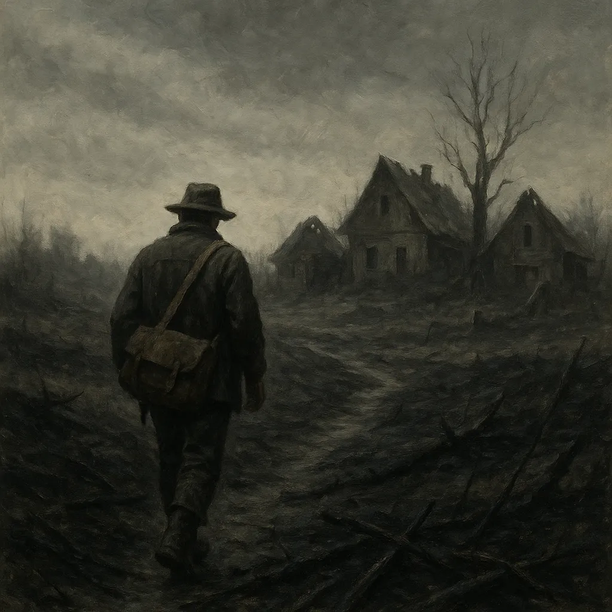
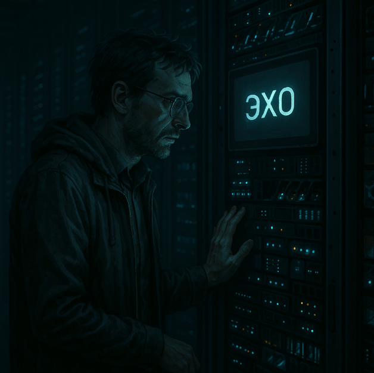
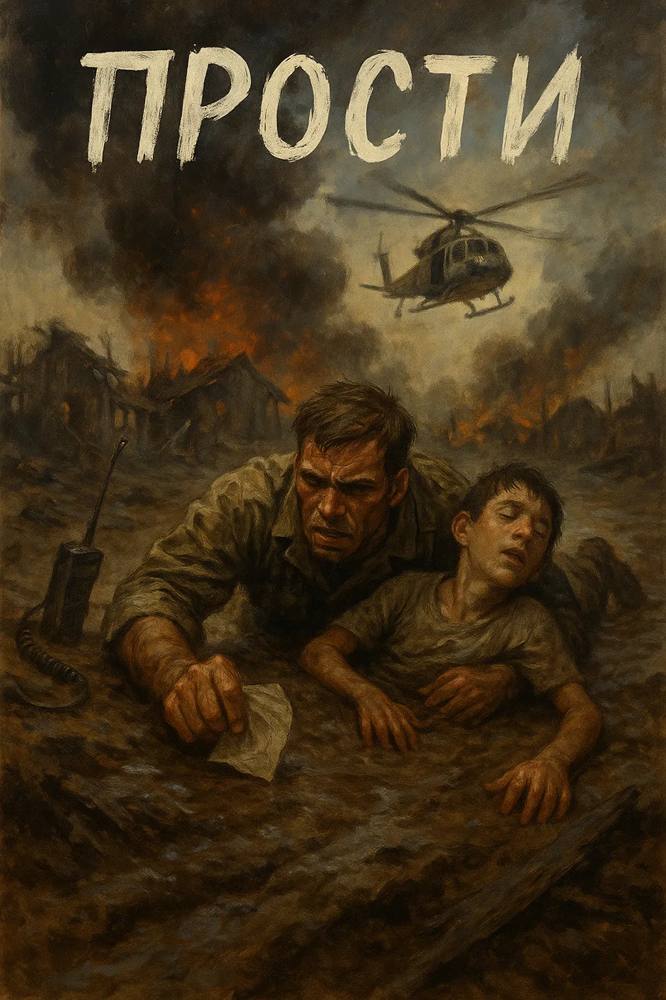
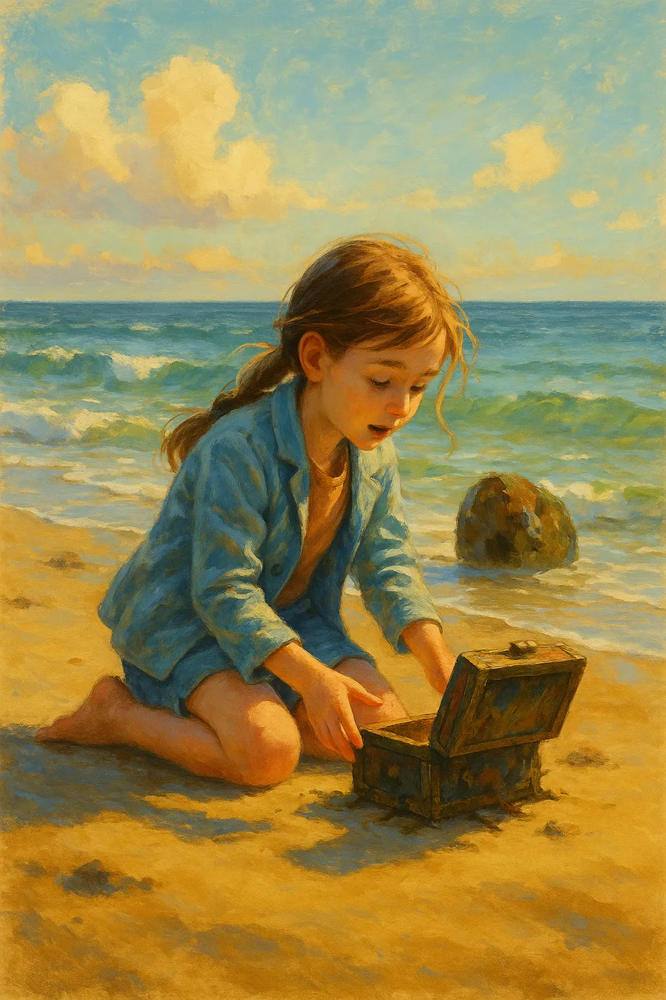
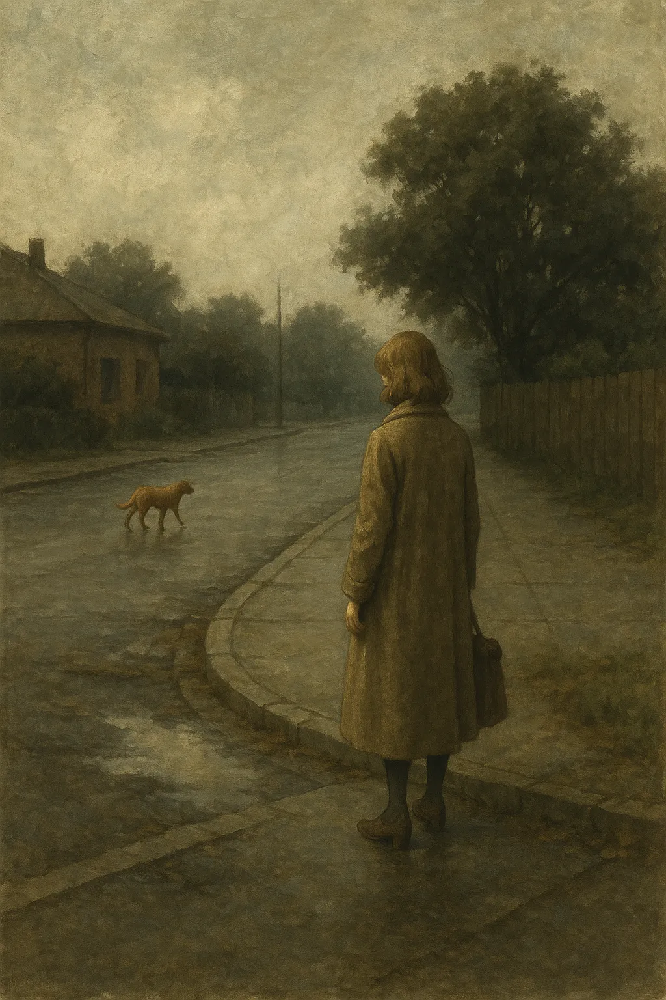
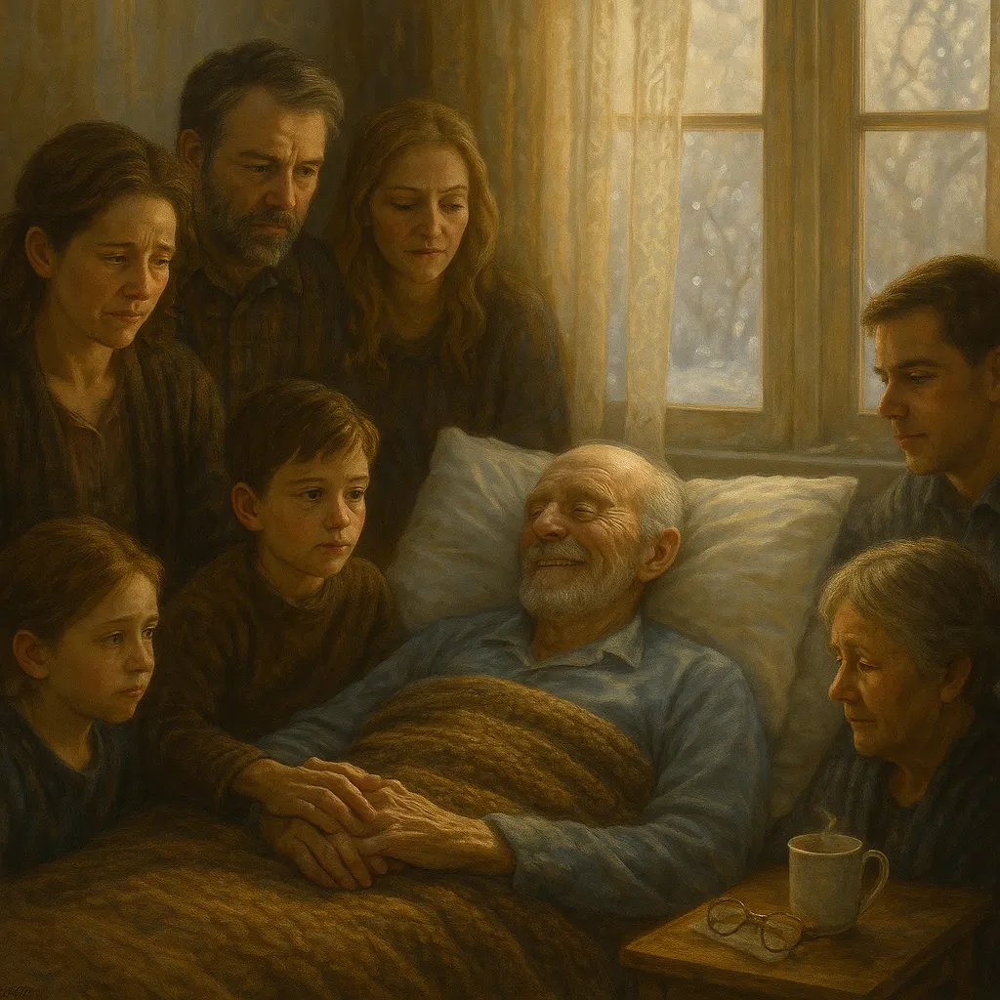
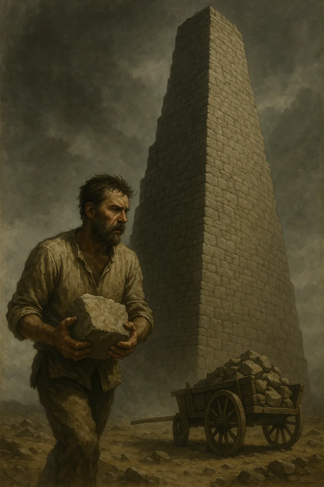
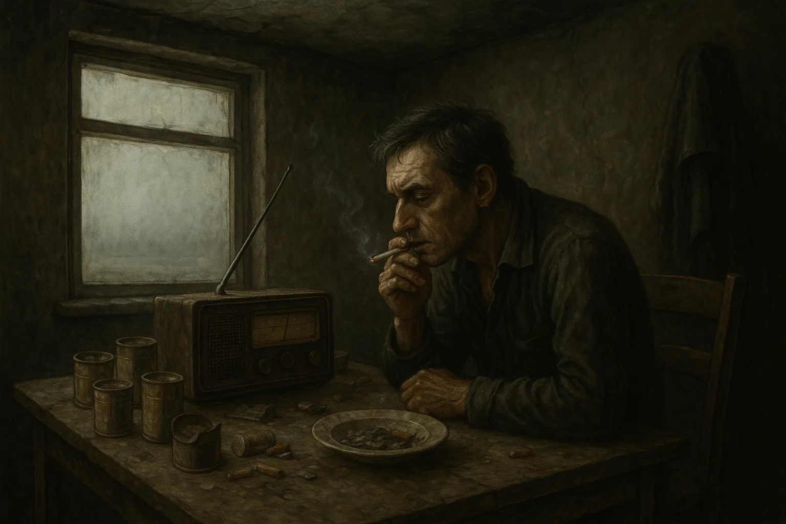
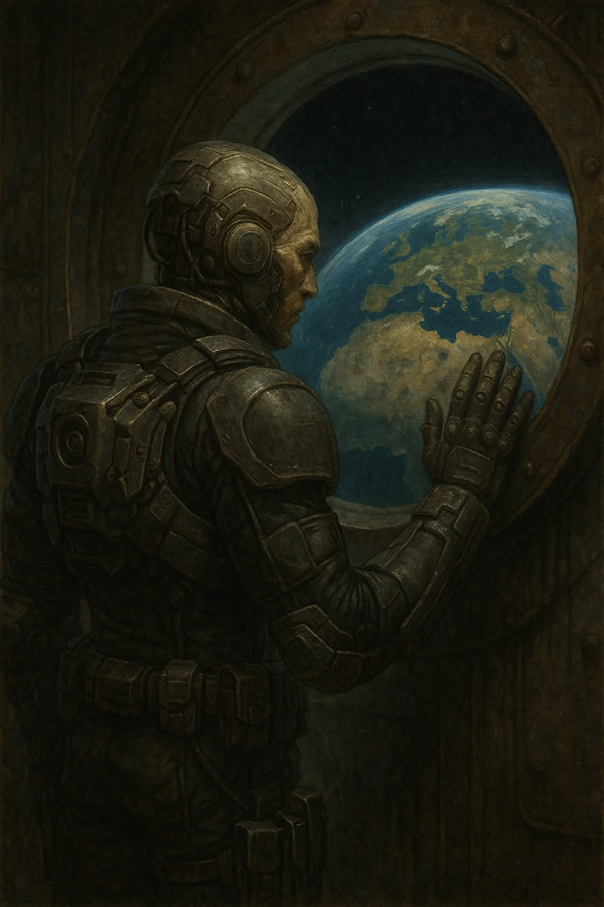
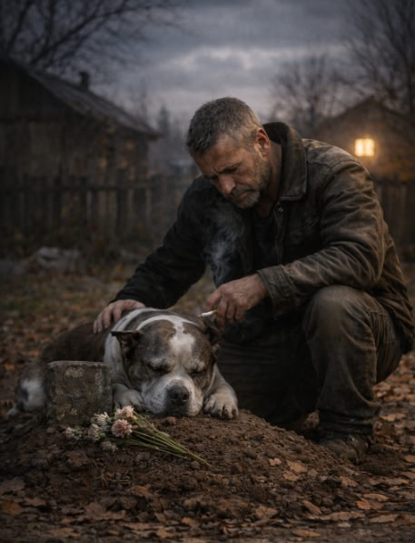

<!--
Project: Brabus Stories
Company: EasyProTech LLC (www.easypro.tech)
Dev: Brabus
Date: Fri 24 Oct 2025 02:36:00 UTC
Status: Updated
Telegram: https://t.me/easyprotech
-->

# Рассказы Брабуса

**Сборник коротких рассказов**

**[English](README.md) | Русский**

   

   

   

---

Я — Брабус.
Работаю там, где код превращается в системы и где точность важнее слов.
Пишу прозу, когда нужно сказать то, что кодом не выразишь.

---

## Рассказы

<table>
<tr>
<td width="30%">

</td>
<td width="70%">

### [Мёртвая тишина](mertvaya_tishina_ru.md) | [English version](dead_silence.md)

Человек ищет среди пепла деревни того, кого больше может не существовать. Иногда тишина говорит громче любого крика.

</td>
</tr>
<tr>
<td width="30%">

</td>
<td width="70%">

### [Эхо](ekho_ru.md) | [English version](echo.md)

В засекреченном дата-центре инженер обнаруживает, что искусственный интеллект может изучать не только данные — он может научиться скорбеть. Последующий разговор меняет всё.

</td>
</tr>
<tr>
<td width="30%">

</td>
<td width="70%">

### [Прости](prosti_ru.md) | [English version](forgive.md)

Морпех несёт подростка с инвалидностью через враждебные джунгли, преследуемый воспоминаниями о мальчике, которого когда-то мучил. У искупления есть цена, и она всегда выплачивается полностью.

</td>
</tr>
<tr>
<td width="30%">

</td>
<td width="70%">

### [Дар моря](dar_morya_ru.md) | [English version](gift_of_the_sea.md)

Потёртая шкатулка выбрасывается на берег, неся с собой десятилетия потерянного времени и силу исцелить старые раны. Море помнит то, что мы забываем.

</td>
</tr>
<tr>
<td width="30%">

</td>
<td width="70%">

### [Оставленное](ostavlennoe_ru.md) | [English version](left_behind.md)

Она идёт по комнатам, которые всё ещё хранят его присутствие, ничего не трогая, ничего не меняя. Некоторые уходы оставляют эхо, которое никогда не затихает.

</td>
</tr>
<tr>
<td width="30%">

</td>
<td width="70%">

### [Последняя улыбка Сэма](poslednyaya_ulybka_sema_ru.md) | [English version](sams_last_smile.md)

Последние мгновения старика становятся праздником хорошо прожитой жизни в окружении семьи, созданной из любви и упрямства. Свет, который остаётся.

</td>
</tr>
<tr>
<td width="30%">

</td>
<td width="70%">

### [Каменная вечность](kamennaya_vechnost_ru.md) | [English version](stone_eternity.md)

День за днём человек строит башню из камней, движимый целью, которую больше не может вспомнить. Работа продолжается, потому что работа должна продолжаться.

</td>
</tr>
<tr>
<td width="30%">

</td>
<td width="70%">

### [Голос между частотами](golos_mezhdu_chastotami_ru.md) | [English version](voice_between_frequencies.md)

В окутанной туманом комнате сломанное радио начинает говорить. Голос знает то, что знать не должен, и задаёт вопросы, на которые нет безопасных ответов.

</td>
</tr>
<tr>
<td width="30%">

</td>
<td width="70%">

### [Проект 728-41: Часть I — Начало](proekt_728-41_part1_ru.md) | [English version](project_728-41_part1.md)

Существо возрастом четыре миллиарда лет смотрит на голубую планету с орбиты, вспоминая эксперимент, создавший человечество. Они сопротивлялись с первого дня. Они не сдавались никогда. И взгляд одного ребёнка изменил всё.

</td>
</tr>
<tr>
<td width="30%">

</td>
<td width="70%">

### [Проект 728-41: Часть II — Средние века](proekt_728-41_part2_ru.md) | [English version](project_728-41_part2.md)

Тоскана, 1348. Чума ползёт к стенам монастыря. Монах несёт хлеб осуждённому еретику — зная, что сгорит рядом с ним. Наблюдатель записывает это как «нерациональное милосердие». Он не может это классифицировать.

</td>
</tr>
<tr>
<td width="30%">

</td>
<td width="70%">

### [Проект 728-41: Часть III — Карибский кризис](proekt_728-41_part3_ru.md) | [English version](project_728-41_part3.md)

Атлантика, 1962. Советская подлодка на глубине 80 метров. Один человек говорит «нет» ядерному пуску. Наблюдатель стоит в трёх метрах. Он не понимает. Он не хочет понимать.

</td>
</tr>
<tr>
<td width="30%">

</td>
<td width="70%">

### [Бад](bad_ru.md) | [English version](bad.md)

Ветеран войны отказывается убить щенка во время криминальной инициации — и этот отказ определяет всю его жизнь. Через тюрьму, зависимость и потери рядом остаётся один пёс: свидетель его человечности.

</td>
</tr>
</table>

---

## Репозиторий

**GitHub:** [https://github.com/EPTLLC/Brabus-Stories](https://github.com/EPTLLC/Brabus-Stories)

Клонировать репозиторий:
```bash
git clone https://github.com/EPTLLC/Brabus-Stories.git
```

## Языки

Каждый рассказ доступен на английском и русском языках. Кликните по ссылкам выше для чтения прямо на GitHub или клонируйте репозиторий для оффлайн чтения:
- Английские версии: `story_name.md`
- Русские версии: `story_name_ru.md`

---

## Лицензия

Эти рассказы выпускаются под двойной лицензионной моделью:
- **[Creative Commons BY-NC-SA 4.0](LICENSE)** для некоммерческого использования
- **[Коммерческая лицензия](LICENSE-COMMERCIAL)** для коммерческого применения

**Некоммерческое использование:** Бесплатно под Creative Commons — делитесь, адаптируйте, но указывайте авторство и сохраняйте некоммерческий характер.  
**Коммерческое использование:** Требует отдельного лицензирования для публикации, адаптации, распространения или любого использования с получением прибыли.

По вопросам коммерческого лицензирования: [https://t.me/easyprotech](https://t.me/easyprotech)

---

## О проекте

**Брабус** | **EasyProTech LLC**  

Системы я строю для работы.  
Истории пишу для себя.  
И то, и другое — про правду, спрятанную глубже поверхности.

**Контакт:** [https://t.me/easyprotech](https://t.me/easyprotech)  
**Компания:** [www.easypro.tech](https://www.easypro.tech)

---

*«Код — это логика. Истории — это истина. Оба необходимы.»*
